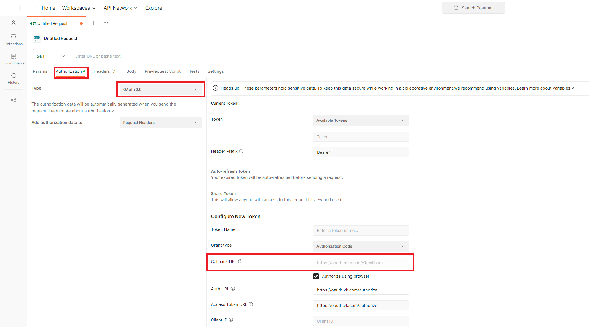
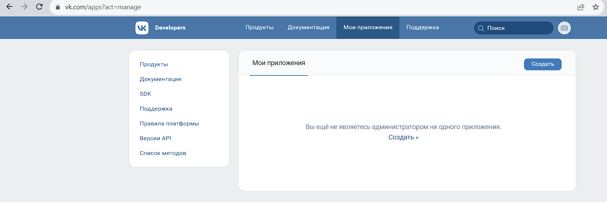
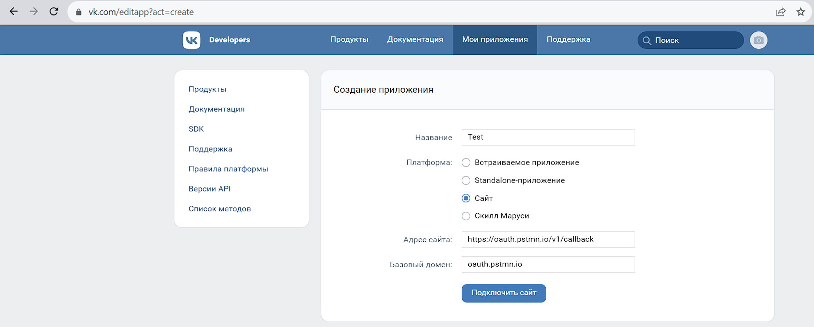
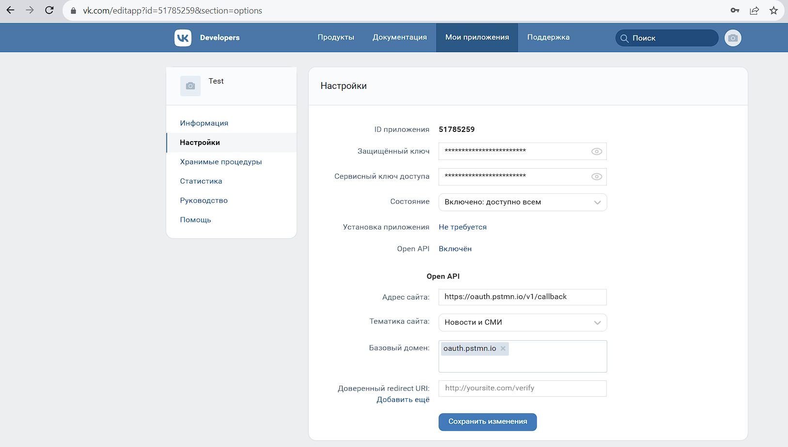
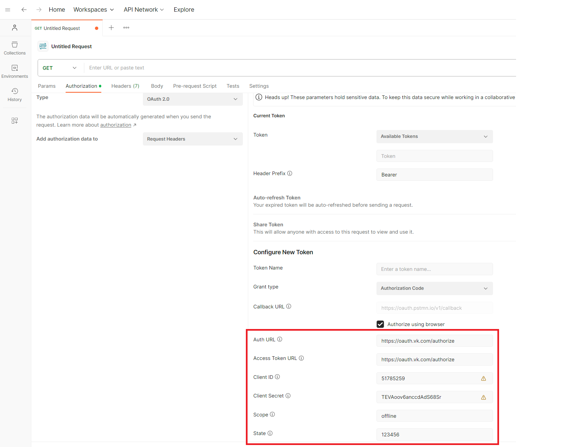
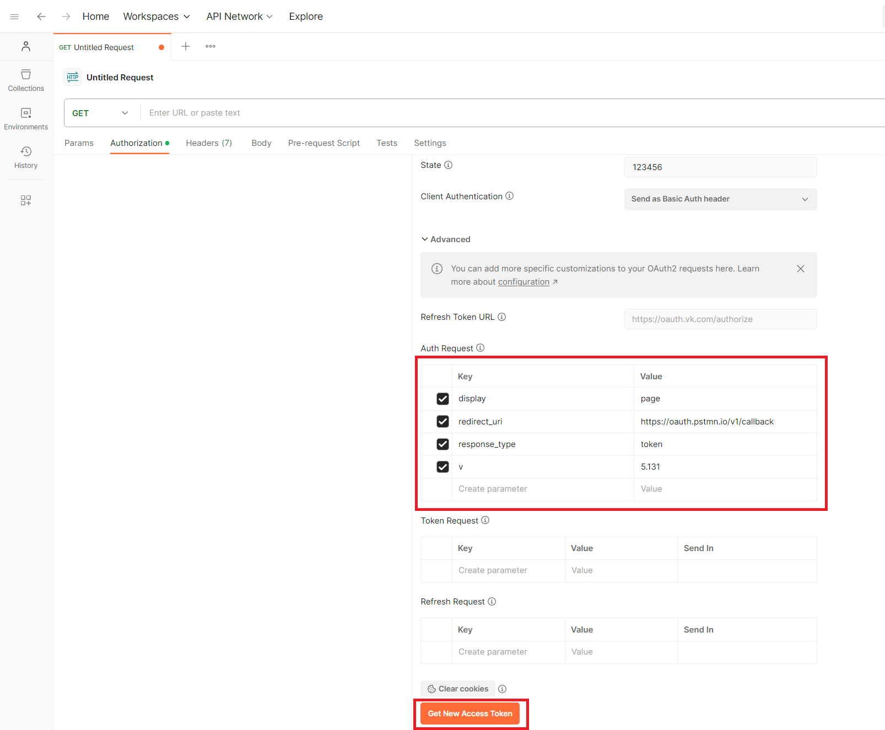
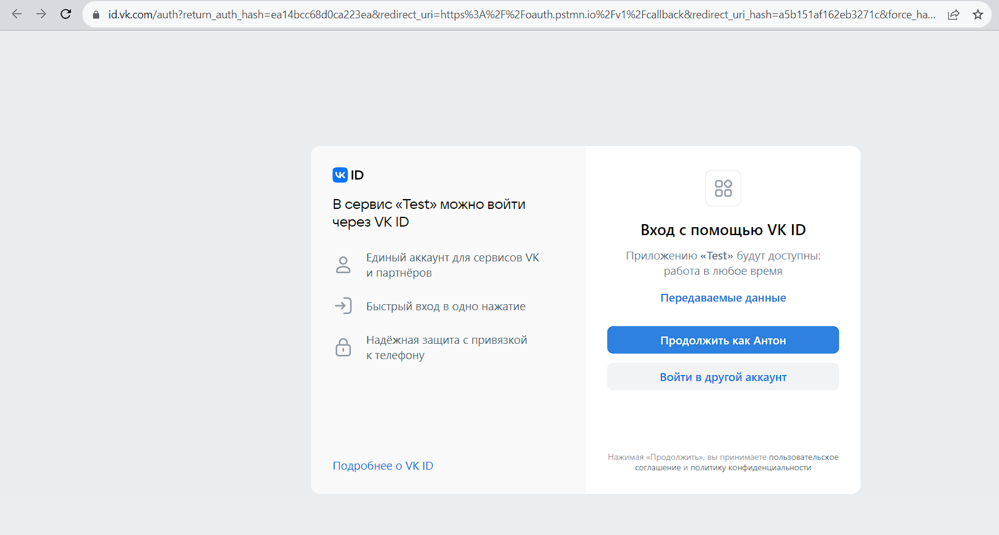
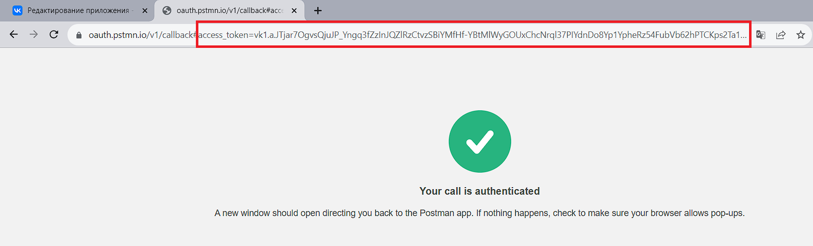
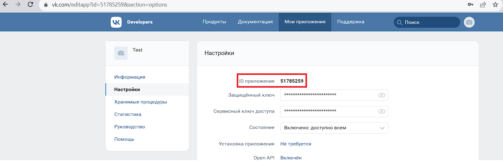
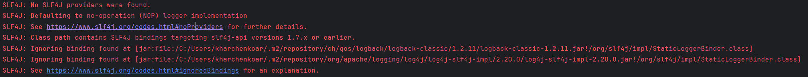

# Задание:
Дано: Java 8, без фреймфорков  
Нужно: реализовать автоматическое создание видео-встречи в VK при помощи:
1. VK API (Решение в классе AppVkWebClient.java)
2. SDK (Решение в классе AppVkSdk.java)

На вход приходит название встречи. На выходе получаем ссылку.

Для получения access_token необходимо в postman создать запрос, перейти на вкладку Authorization, выбрать OAuth 2.0, и скопировать Callback URL, он понадобится далее.

Затем создаем приложение vk, для этого открываем страницу [Мои приложения](https://vk.com/away.php?to=https%3A%2F%2Fvk.com%2Fapps%3Fact%3Dmanage) и нажимаем на кнопку Создать.

Заполняем название, Выбираем платформу = Сайт и в адрес сайта вставляем скопированный из postman Callback URL и нажимаем Подключить сайт

В созданном приложении переходим на вкладку Настройки

Возвращаемся в postman и заполняем поля  
Auth URL = https://oauth.vk.com/authorize  
Access Token URL = https://oauth.vk.com/authorize  
Client ID = <ID приложения>  
Client Secret <Защищённый ключ>  
Scope = offline  
State = 123456  

И добавляем параметры в Auth Request:  
display = page  
redirect_uri = https://oauth.pstmn.io/v1/callback   
response_type = token  
v = 5.131

Нажимаем Get New Access Token  
Откроется окно в браузере, в котором нужно подтвердить авторизацию в приложении

После подтверждения произойдет переадресация. Из урла необходимо скопировать access_token и вставить в java код.

Для использования SDK также понадобится ID приложения

Обратите внимание: при использовании sdk рекомендовано включить логирование, иначе в логах будут варнинги.  
Подробнее см. документацию [Логирование](https://dev.vk.com/ru/sdk/java#%D0%9B%D0%BE%D0%B3%D0%B8%D1%80%D0%BE%D0%B2%D0%B0%D0%BD%D0%B8%D0%B5)

